## Introduction

The essential concern with missing data is the potential selection bias produced by the mechanism of the missingness [1]. For instance, the MAR assumption, i.e. the likelihood of missing data variable Y being missing is unrelated to the value of Y after controlling for observed covariates available in the data set. A complete case model under the MAR assumption may lead to biased results because the outcome patterns in subjects with complete data may differ from those with missing data. The degree of bias can be considerable, particularly if there are large volumes of missing data [2] and [1]. Besides, complete case analysis can also result in a significant loss of sample size [2] [1].

In recent years there have been increased recommendations from scientific publications to apply methodolgical approaches to missing data problems [3]. Multiple imputations (MI) is one of the common powerful approaches to treat the incomplete data problem that has several advantages. MI works as follows. First, every missing value is being predicted based on a model that includes the other covariate in addition to some chosen auxiliary variables. Second, the process is repeated in an iterative fashion resulting in multiple completed data sets. Every time the imputation round happens, a slightly different value is produced. Under the MAR assumption, this imputation procedure produces unbiased estimates of the missing data values. (add the pooling if the pooled results are positive)

In this work, we applied the MI approach to the existing missing cases. We assessed that MI is a valid approach given that potential loss of information resulted from the missing data amount. (gives the missingness percentage to the top 3 or 5 variables). We followed the latest scientific recommendations for assessing the use of the Multiple Imputation method [4]. In the executed MI workflow, we included all the variables that we planned to use in the Bayesian Network analysis. Besides, We included an additional set of auxiliary variables that correlate or predict the pattern of the missingness (For instance, features that are related to the nonresponse or variables that are known to have influenced the occurrence of missing data such variables may contain information and reasons for nonresponse). This is motivated by the expected improvements in the plausibility of the MAR assumption underlying MI [5]. We used the mice R package to conduct the imputation in a High-Performance Computing environment [6].


## R libraries and data

```{r libraries}
library(mice)
library(dplyr)
library(naniar)
library(finalfit)
library(haven)
library(miceadds)
library(tibble)
library(VIM)
library(bnlearn)
library(dagitty)
```


```{r data}
data_all_original = read_dta("/home/rstudio/MissingdataArticle/data&Objects/Analysis_dataset(60)25.2.21.dta.dta")
data_all = Prepare_data(data_all_original)
data_all = Preprocess_Data(data_all)
```

### Assessing the missing data

Let us start by looking at some plots to help us understand the missing data patteren better. We will be using the R package naniar for that reason.

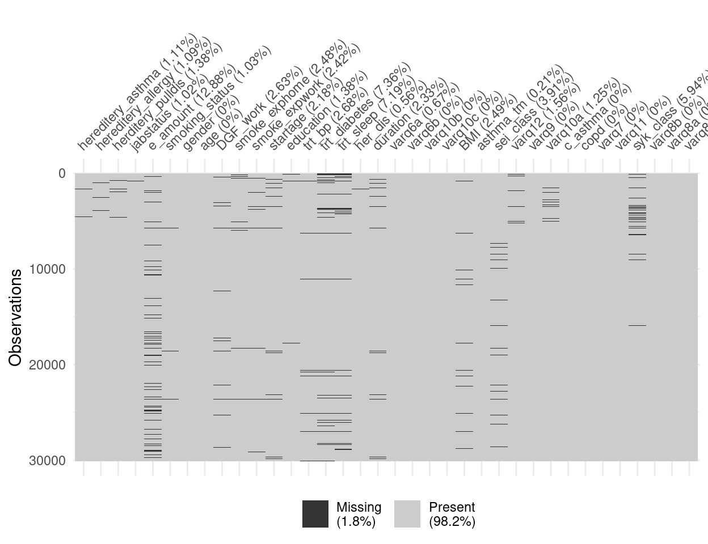


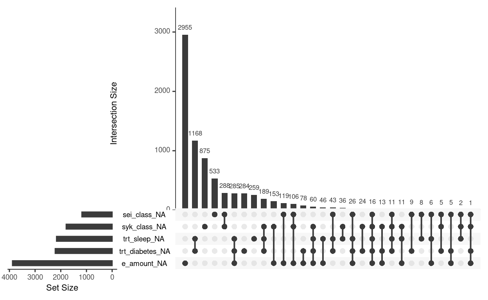

We can see from the figures above that the missingness percentage is 1.81.8. In the second figure, we see the top five variables that include missingness and the intersection between these five variables with the most amount of missingness is in the variable e_amount (electrical smoking). Let us look at some important variables for our study in more detail, In the figure below we examine the sei_class variable. We plot the percentage of the missingness within each category of the sei_class variable.

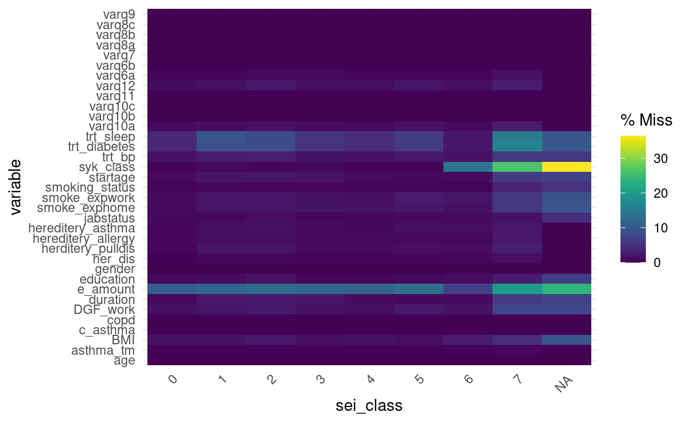

We can see that people with the class 6 and 7 has a high missingness percentage compared to the rest of the classes with regards to both the trt_bp and e_amount.

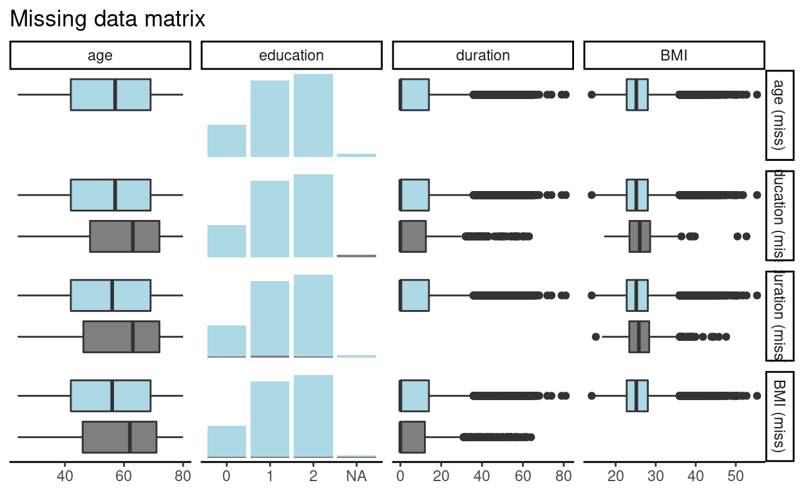

We can see that people with missing values in Duration are older than those who reported that duration value. This suggests that the missing mechanism is MAR as the pattern of missingness depends on the age variable and not on duration itself. However, we still need to test for the MNAR as it may be the case that the duration itself has an effect. Let us try different variables to test against the age and education variables. For instance, the startage and syk_class variables.

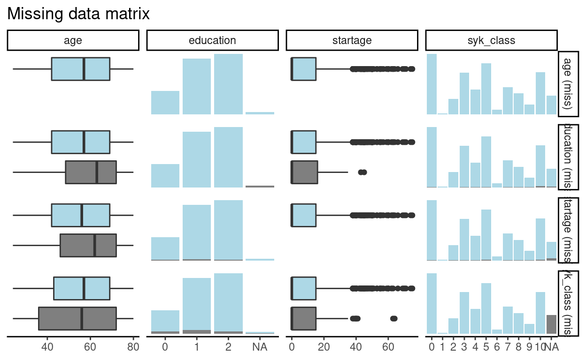

The same holds for the startage variable. the same for the relationship between age and education: it seems that patients with missing education are older than with non-missing. This means that adjusting for age should solve the case.

## Missing Value Imputation

The above presentation motivates us to perform the MI using the MICE approach. The full description and reproducible workflow can be found [in this Github repository](https://github.com/ranibasna/Modification_Effect_Socioeconomic_smoking_Asthma/blob/master/R/HPC_R_mice_BN_code.R). The code is written in a style to be used inside a High-performance computing environment (HPC). The process of performing MI is going like this.

1. We first processes the original data by dropping the highly correlated variables
2. Due to high dependencies between some variables we impose which variables to include in the predictive matrix that is used by mice imputation.
3. We apply the parlmice which is the version of the R function mice that can perform a parallel computation

```{r, eval=FALSE}
parlmice(data = data_all, n.core = 8, n.imp.core = 7, maxit = 40, predictorMatrix = pred, seed = 11)
```

Where n.core is number of cores and n.imp.cores number of imputations per core.

## Validating the Imputation Process

```{r, cache=TRUE, message=FALSE}
# sample from the big imputed mice model to select smaller number of multiple imputations
imp_parl_final = readRDS(file = "/home/rstudio/socioeconomics/data&Objects/final_mice_model.rds")
datalist = mids2datlist(imp_parl_final)
mids_subset = subset_datlist(datalist, index = 70:85, toclass = "mids")
```

```{r, cache=TRUE}
xyplot(mids_subset,BMI ~ startage + duration,pch=18,cex=1)
```

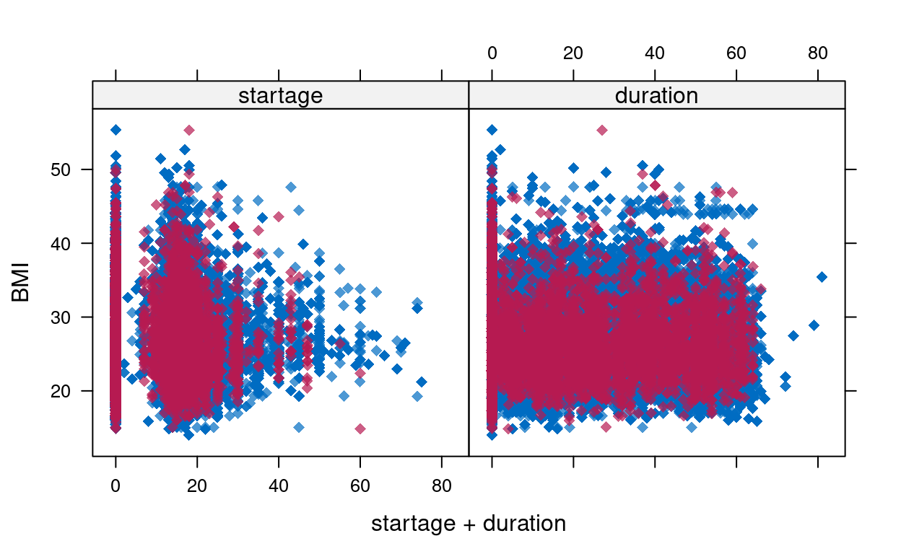

```{r, cache=TRUE}
densityplot(mids_subset)
```

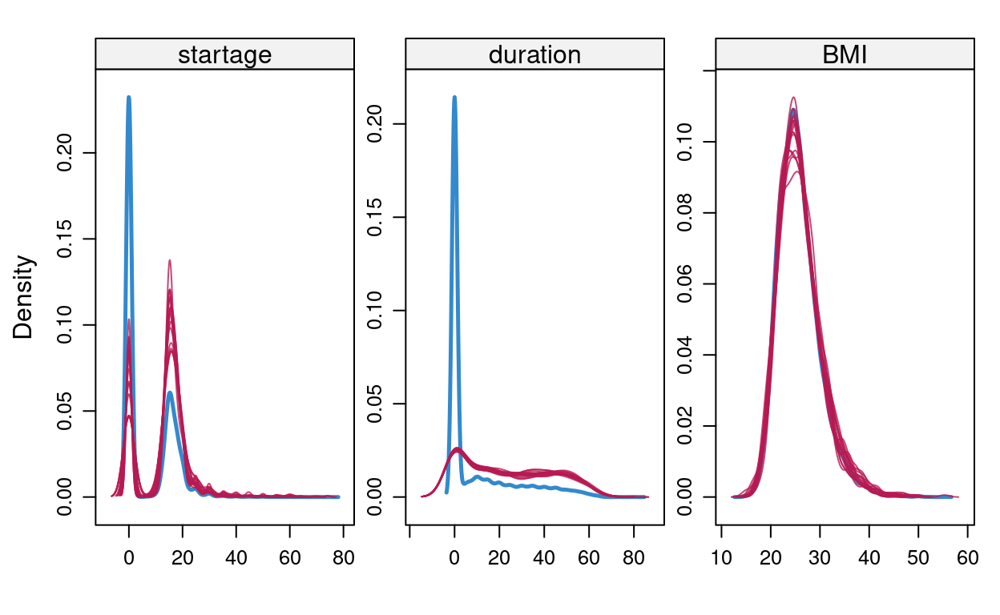

As seen the imputation model is predicting that most people with missing data are actually a smoker. This explains why the spike of non smokers has disappeared in the imputation models for the duration variable in the figure above.


```{r, cache=TRUE}
stripplot(mids_subset, pch = 20, cex = 1.2)
```
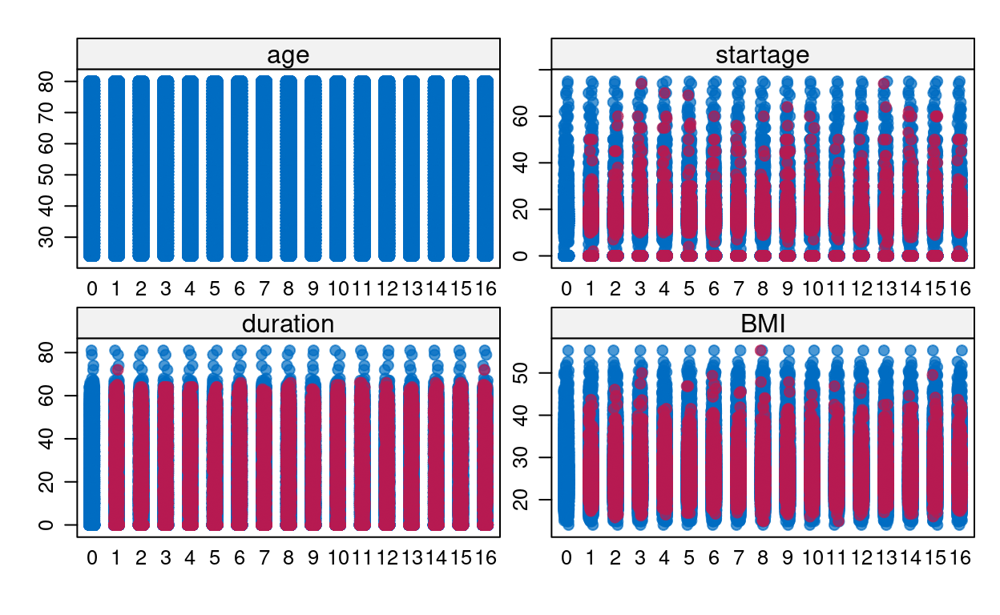

```{r, cache=TRUE}
imp_data = complete(imp_parl_final, 1)
```

```{r, cache=TRUE}
df_1 = data_all %>% select(c(BMI, age)) %>% rename(BMI_imp = BMI) %>%
  mutate(BMI_imp = as.logical(ifelse(is.na(BMI_imp),"TRUE","FALSE"))) %>% rownames_to_column()
df_2 = imp_data %>% select(age, BMI) %>% rownames_to_column()
df = left_join(df_1,df_2)
#
df = as.data.frame(df)
vars = c("age", "BMI","BMI_imp")
marginplot(df[,vars], delimiter="imp", alpha=0.6, pch=c(19))
```

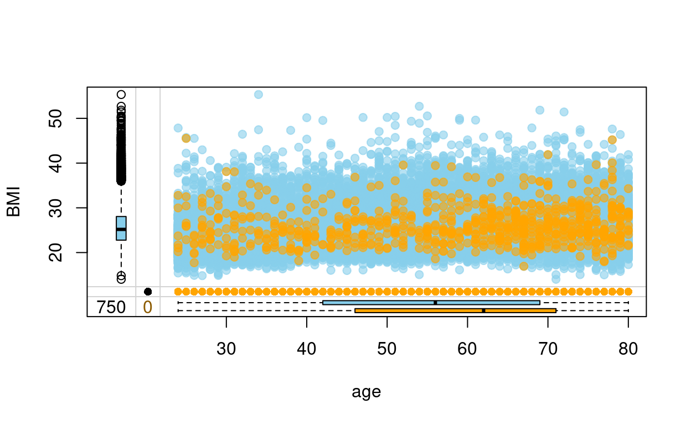

```{r, cache=TRUE}
df_1 = data_all %>% select(c(duration, age)) %>% rename(duration_imp = duration) %>%
  mutate(duration_imp = as.logical(ifelse(is.na(duration_imp),"TRUE","FALSE"))) %>% rownames_to_column()
df_2 = imp_data %>% select(age, duration) %>% rownames_to_column()
df = left_join(df_1,df_2)

df = as.data.frame(df)
vars = c("age", "duration","duration_imp")
marginplot(df[,vars], delimiter="imp", alpha=0.6, pch=c(19))
```
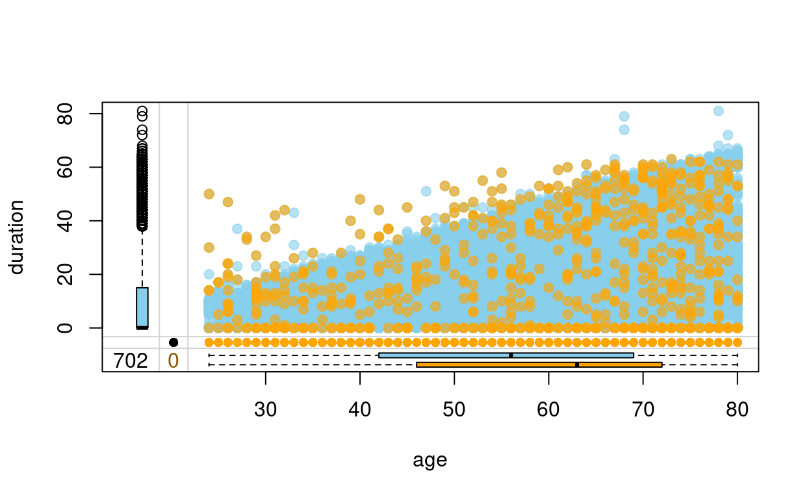


We can see that the imputation model corrects for the fact that the people with older age tend to have missing values are duration and start age, which can be attributed to the fact that either they forgot the starting age (hence the duration as well). Or they did not want to include that information as it makes them feel they have been smoking for a long time. This is still valid under the MAR assumption.

```{r, cache=TRUE}
#cat_var = sei_class
df_1 = data_all %>% select(c(BMI, sei_class)) %>% rename(sei_class_imp = sei_class) %>%
  mutate(sei_class_imp = as.logical(ifelse(is.na(sei_class_imp),"TRUE","FALSE"))) %>% rownames_to_column()

df_2 = imp_data %>% select(sei_class, BMI) %>% rownames_to_column()

df = left_join(df_1,df_2)
df = as.data.frame(df)
vars = c("BMI","sei_class","sei_class_imp")
barMiss(df[,vars], delimiter = "_imp", selection = "any", only.miss = FALSE)
##
df_1 = data_all %>% select(c(BMI, syk_class)) %>% rename(syk_class_imp = syk_class) %>%
  mutate(syk_class_imp = as.logical(ifelse(is.na(syk_class_imp),"TRUE","FALSE"))) %>% rownames_to_column()
df_2 = imp_data %>% select(syk_class, BMI) %>% rownames_to_column()
df = left_join(df_1,df_2)
df = as.data.frame(df)
vars = c("BMI","syk_class","syk_class_imp")
barMiss(df[,vars], delimiter = "_imp", selection = "any", only.miss = FALSE)
```

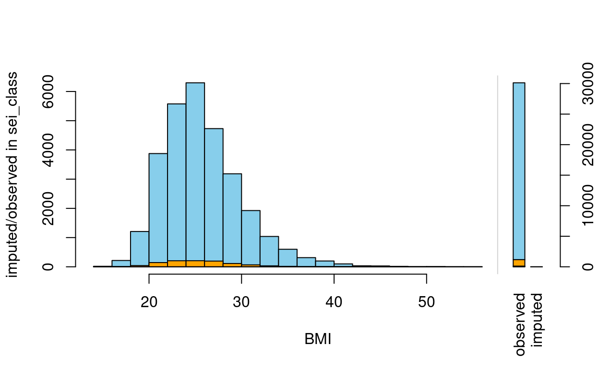

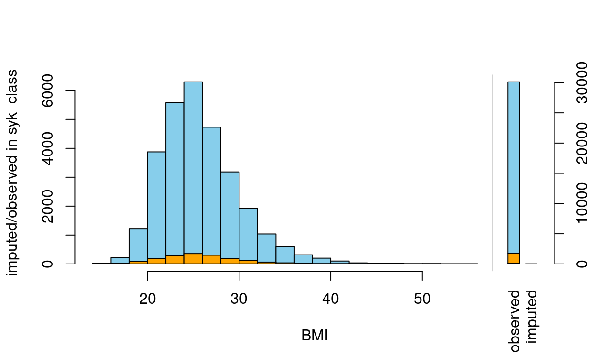


In general, all our validation plots look healthy and the imputation processes reflect our beliefs about the reason for missing values. We have been investigating only the important variables. A similar analysis process can be applied to different variables to do the checks.

## The dag

Next we will use the dag theory to run a sensitivity analysis to validate the missing data imputation. If you are not familiar with the dag theory it is recommended to read about. For instance see [7] for more details.

(In)dependency structure can be identified in Bayesian networks, particularly with Directed Acyclic Graphs (DAGs), which are probabilistic graphical models. DAGs learn the underlying dependency structure represent these as networks with directed connections. In simple, the dag allow us to find a minimal set of variables that is needed to study the effect of specific exposure and on an outcome.

```{r BNObject}
str.bootstrap_mice_hc = readRDS(file = "/home/rstudio/MissingdataArticle/data&Objects/boot_mice_final_hc.rds")
str.bootstrap_mice_hc_filterd = str.bootstrap_mice_hc[with(str.bootstrap_mice_hc, strength >= 0.95 & direction >= 0.5), ]
avg.simpler_mice_hc  = averaged.network(str.bootstrap_mice_hc_filterd)
avg.simpler_mice_hc  = cextend(averaged.network(str.bootstrap_mice_hc_filterd))
# convert to dagitty structure
bn_dagitty = bn_to_adjmatrix(cextend(avg.simpler_mice_hc))
bn_dagitty = adjmatrix_to_dagitty(bn_dagitty)
```

```{r}
# install.packages("ggdag")
# library(ggdag)
bn_dag_adjustment = adjustmentSets(x = bn_dagitty, exposure = c("sei_class"), outcome = c("c_asthma"), effect = "direct")
adjustment_vars = c(bn_dag_adjustment[[2]], c("education"))
```


## Sensitivity analysis

Since the MAR hypothesis cannot be verified from observed data [2], it is essential to perform sensitivity analyses. Sensitivity analyses will appraise the impact on the current research question imputation results of departures from this MAR assumption.

One proposed method is the use of the delta adjustment method. This approach allows a simple and flexible way by which to impute the incomplete data under general MNAR mechanisms, and thus to assess sensitivity to departures from MAR. The method was originally introduced first by the work of Rubin [8], it has also been described and used by van Buuren et al. [2] and implemented for a variety of variable types in the R package SensMice by Resseguier et al [9]. which we used in our work.

To do sensitivity analysis, we apply multiple forms of perturbations to the variables with missing data before applying the imputation process. Then we conduct a regression analysis on the different perturbed imputed sets. The hypothesis is that if the missingness mechanism is of MAR type, then the results should be similar as the imputation process uses the predictive covariates to predict the missing values and the missing value pattern is independent of the value of the variable itself.  

In Specific, After fitting an imputation model for the incomplete variable Y under MAR, implementation of the delta-adjustment method involves adding or deducting a fixed number $\delta$ to the current predictor before imputing missing data using the proposed model. In this sense, it is a simple representation of the pattern-mixture model. When Y is binary and the incomplete data are predicted using a logistic regression model, $\delta$ represents the difference in the log-odds of Y = 1 for individuals with missing Y values compared with individuals with observed Y values.


We follow the 3-step strategy proposed by [9]

 1. Fit an imputation model assuming ignorable missing Data;
 2. Adjust the imputation model by adding a fixed quantity $\delta$  to the linear predictor before imputing missing data using the updated model. This $\delta$ specifies a realistic scenario ( usually this is a set of plausible $\delta$-values that assume a MNAR situation). When the variable with missing data Y, is binary and the missing data are imputed using a logistic regression model, $\delta$ represents the difference in the log-odds of Y for individuals with missing Y values compared with individuals with observed Y values.
 3. Impute missing Data under the scenario specified in point 2.

In practice, we will select test the above explained approach on the syk_class valriable. The same can be done on other important variable. syk_class is chosen since it has plenty of missingness compared to other variable as well as since it is one of the key variable in the study. For this analysis to be preformed, we will use three $\delta$ values $0,1$ and $1.5$.    

```{r SenAna, cache=TRUE}
# e_amount, sei_class and syk_class has the highst missingness.
imp_test_method = mids_subset
# changing the type to polyreg since polr is not yet supported in the package SensMice
imp_test_method$method["sei_class"] = "polyreg"
imp_test_method$method["syk_class"] = "polyreg"
# get a mice object with the sensitivity analysis
#
sen_ana_mice_imp_1 = sens.mice(IM = imp_test_method, ListMethod = c("","","","","","","","","","","","","","","","","","","","","","","","","","","","","","", "","","MyFunc","","",""), SupPar = c(0.5, 0.5,0.5,0.5,0.5,0.5, 0.5, 0.5, 0.5,0.5))
#
sen_ana_mice_imp_2 = sens.mice(IM = imp_test_method, ListMethod = c("","","","","","","","","","","","","","","","","","","","","","","","","","","","","","", "","","MyFunc","","",""), SupPar = c(1, 1,1,1,1,1, 1, 1, 1,1))
#
sen_ana_mice_imp_3 = sens.mice(IM = imp_test_method, ListMethod = c("","","","","","","","","","","","","","","","","","","","","","","","","","","","","","", "","","MyFunc","","",""), SupPar = c(1.5, 1.5,1.5,1.5,1.5,1.5, 1.5, 1.5, 1.5,1.5))
```

```{r Senfitting, cache=TRUE}
# fit a glm model on the main mice object
fit_c_as_main = with(mids_subset, glm(as.formula(paste("c_asthma ~ ", paste(adjustment_vars, collapse= "+"))), family = binomial))
fits_pool = fit_c_as_main %>% mice::pool()

# fit the sen_ana sensitivity analysis imputed data
fit_c_as_sen_ana_big = with(sen_ana_mice_imp_1, glm(as.formula(paste("c_asthma ~ ", paste(adjustment_vars, collapse= "+"))), family = binomial))
fits_pool_sen = fit_c_as_sen_ana_big %>% mice::pool()

#
fit_c_as_sen_ana_big_2 = with(sen_ana_mice_imp_2, glm(as.formula(paste("c_asthma ~ ", paste(adjustment_vars, collapse= "+"))), family = binomial))
fits_pool_sen_2 = fit_c_as_sen_ana_big_2 %>% mice::pool()

#
fit_c_as_sen_ana_big_3 = with(sen_ana_mice_imp_3, glm(as.formula(paste("c_asthma ~ ", paste(adjustment_vars, collapse= "+"))), family = binomial))
fits_pool_sen_3 = fit_c_as_sen_ana_big_3 %>% mice::pool()
```

Let us looks at the summary results of the original regressing model and the model that uses $\delta$ value equal $1$.
An easy way to compare is to plot the odds ratios for all the four models


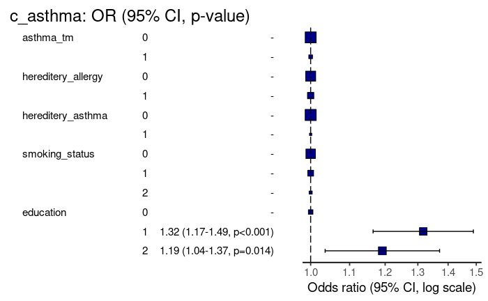

As seen from the above plots the fours models results in similar odss ratios.  

## Conclusion
A sensitivity analysis was performed on data from the WSAS and OLIN, to assess the robustness of the OR between asthma and education, including missing Data. We assumed that non-responders were more likely to have a lower education compared to the responders. This assumption has been reflected with the inserted set of $\delta$ values. The modified ORs were stable and robust to the multiple introduced perturbation and scenarios. This strengthens our approach of using the multiple imputations assuming the MAR mechanism.

## References


[1]
Perkins N J, Cole S R, Harel O, Tchetgen Tchetgen E J, Sun B, Mitchell E M and Schisterman E F 2018 Principled approaches to missing data in epidemiologic studies American journal of epidemiology 187 568–75

[2] Van Buuren S 2018 Flexible imputation of missing data (CRC press)

[3]
Little R J, D’Agostino R, Cohen M L, Dickersin K, Emerson S S, Farrar J T, Frangakis C, Hogan J W, Molenberghs G, Murphy S A and others 2012 The prevention and treatment of missing data in clinical trials New England Journal of Medicine 367 1355–60

[4]
Nguyen C D, Carlin J B and Lee K J 2017 Model checking in multiple imputation: An overview and case study Emerging themes in epidemiology 14 1–2

[5]
Sterne J A, White I R, Carlin J B, Spratt M, Royston P, Kenward M G, Wood A M and Carpenter J R 2009 Multiple imputation for missing data in epidemiological and clinical research: Potential and pitfalls Bmj 338

[6]
Buuren S van, Groothuis-Oudshoorn K, Robitzsch A, Vink G, Doove L and Jolani S 2015 Package ‘mice’ Computer software

[7] Scutari M and Denis J-B 2014 Bayesian networks: With examples in r (CRC press)

[8] Rubin D B 1977 Formalizing subjective notions about the effect of nonrespondents in sample surveys Journal of the American Statistical Association 72 538–43

[9] Resseguier N, Giorgi R and Paoletti X 2011 Sensitivity analysis when data are missing not-at-random Epidemiology 22 282
