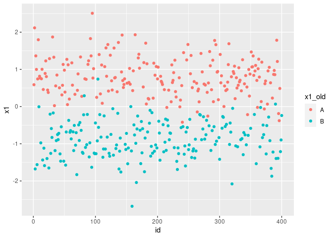
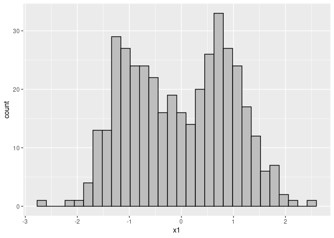
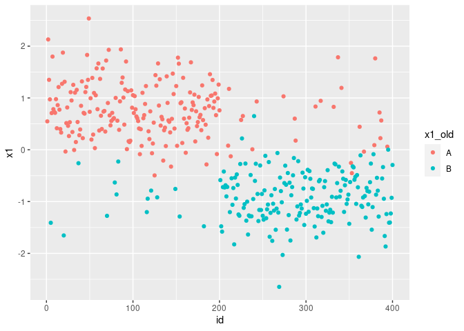
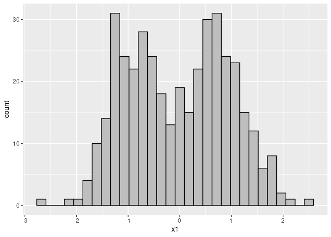

# NumericTransformation

This package intends to convert categorical features into numerical ones. This will help in employing algorithms and methods that only accept numerical data as input. The main motivation for writing this package is to use in clustering assignments.


## Installation


You can install the development version from [GitHub](https://github.com/ranibasna/NumericalTransformation) with:

``` r
# install.packages("devtools")
devtools::install_github("ranibasna/NumericalTransformation")
```
## Example

This is a basic example which shows you how to convert a categorical features to numerical ones:

```{r libraries}
library(ggplot2)
library(NumericTransformation)
library(dplyr)
## basic example code
```


```{r}
# Generate toy data with categorical and numerical columns
n   = 100
prb = 0.5
muk = 1.5
clusid = rep(1:4, each = n)
x1 = sample(c("A","B"), 2*n, replace = TRUE, prob = c(prb, 1-prb))
x1 = c(x1, sample(c("A","B"), 2*n, replace = TRUE, prob = c(1-prb, prb)))
x1 = as.factor(x1)
x2 = sample(c("A","B"), 2*n, replace = TRUE, prob = c(prb, 1-prb))
x2 = c(x2, sample(c("A","B"), 2*n, replace = TRUE, prob = c(1-prb, prb)))
x2 = as.factor(x2)
x3 = c(rnorm(n, mean = -muk), rnorm(n, mean = muk), rnorm(n, mean = -muk), rnorm(n, mean = muk))
x4 = c(rnorm(n, mean = -muk), rnorm(n, mean = muk), rnorm(n, mean = -muk), rnorm(n, mean = muk))
x = data.frame(x1,x2,x3,x4)
summary(x)
```


```{r}
# converting the numerical data using UFT_func
x_converted_data = UFT_func(x, Seed = 22)
#head(x_converted_data)
# bined with the rest of the data
x_converted_data_all = bined_converted_func(converted_data = x_converted_data, original_data = x)
head(x_converted_data_all)
```

```{r}
x_converted_data_all = x_converted_data_all %>% dplyr::mutate(id = row_number())
head(x_converted_data_all)
```


```{r plots}
# plotiing
# adding old non-numerical features
x_converted_data_all$x1_old = x$x1
ggplot(x_converted_data_all, aes(x=id, y=x1, color=x1_old)) + geom_point()
```



```{r}
ggplot(x_converted_data_all, aes(x=x1), color=x1_old) + geom_histogram(bins = 30, color = "black", fill = "gray")
```


## to see clusters

```{r}
n   = 100
prb = 0.9 # we put the prb to 0.9 for clear clusters
muk = 1.5
clusid = rep(1:4, each = n)
x1 = sample(c("A","B"), 2*n, replace = TRUE, prob = c(prb, 1-prb))
x1 = c(x1, sample(c("A","B"), 2*n, replace = TRUE, prob = c(1-prb, prb)))
x1 = as.factor(x1)
x2 = sample(c("A","B"), 2*n, replace = TRUE, prob = c(prb, 1-prb))
x2 = c(x2, sample(c("A","B"), 2*n, replace = TRUE, prob = c(1-prb, prb)))
x2 = as.factor(x2)
x3 = c(rnorm(n, mean = -muk), rnorm(n, mean = muk), rnorm(n, mean = -muk), rnorm(n, mean = muk))
x4 = c(rnorm(n, mean = -muk), rnorm(n, mean = muk), rnorm(n, mean = -muk), rnorm(n, mean = muk))
x = data.frame(x1,x2,x3,x4)
```


```{r}
# converting the numerical data using UFT_func
x_converted_data = UFT_func(x, Seed = 22)
#head(x_converted_data)
# bined with the rest of the data
x_converted_data_all = bined_converted_func(converted_data = x_converted_data, original_data = x)
head(x_converted_data_all)
```


```{r cluster_plots}
# plotiing
x_converted_data_all = x_converted_data_all %>% mutate(id = row_number())
# adding old non-numerical features
x_converted_data_all$x1_old = x$x1
ggplot(x_converted_data_all, aes(x=id, y=x1, color=x1_old)) + geom_point()
```


```{r}
ggplot(x_converted_data_all, aes(x=x1), color=x1_old) + geom_histogram(bins = 30, color = "black", fill = "gray")
```

